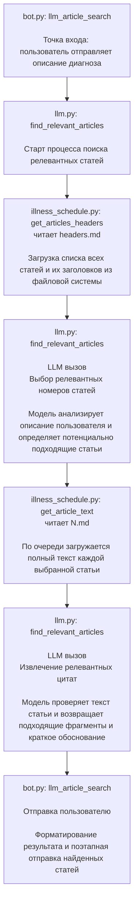

# Работа Телеграм-бота

```mermaid
graph TD
    A[bot.py: llm_article_search<br><br>Точка входа: пользователь отправляет описание диагноза] --> 
    B[llm.py: find_relevant_articles<br><br>Старт процесса поиска релевантных статей]

    B --> C[illness_schedule.py: get_articles_headers<br>читает headers.md<br><br>Загрузка списка всех статей и их заголовков из файловой системы]

    C --> D[llm.py: find_relevant_articles<br><br>LLM вызов<br>Выбор релевантных номеров статей<br><br>Модель анализирует описание пользователя и определяет потенциально подходящие статьи]

    D --> E[illness_schedule.py: get_article_text<br>читает N.md<br><br>По очереди загружается полный текст каждой выбранной статьи]

    E --> F[llm.py: find_relevant_articles<br><br>LLM вызов<br>Извлечение релевантных цитат<br><br>Модель проверяет текст статьи и возвращает подходящие фрагменты и краткое обоснование]

    F --> G[bot.py: llm_article_search<br><br>Отправка пользователю<br><br>Форматирование результата и поэтапная отправка найденных статей]
```